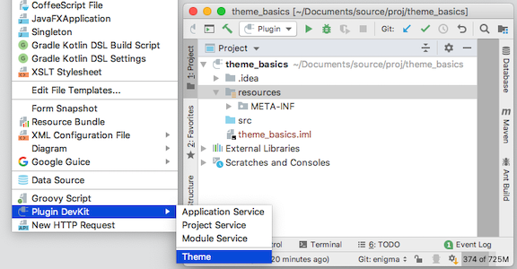
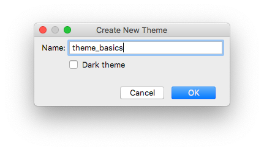

Custom UI Themes give designers control of the appearance of built-in IntelliJ IDEA UI elements. 
Custom UI Themes are distinct from [creating new UI elements](/user_interface_components/user_interface_components.md) for a plugin. 

Creating a custom UI Theme is a process of choosing a base IDE Theme (_Light_ or _Darcula_,) then changing aspects of the base Theme definition. 
Custom UI Themes can:
* substitute icons,
* change the colors of icons and UI controls,
* alter the borders and insets of UI controls,
* provide custom editor schemes,
* add background images.

## The Structure of a UI Theme
UI Themes are components within IntelliJ Platform plugins. 
Theme plugins should be stand-alone plugins, and not combined with other plugin functionality. 
This approach is the best user experience because it avoids an IDE restart when installing a UI Theme plugin.

UI Themes have several components:
* A required Theme description (JSON) file in the plugin project's `src` (source code) folder. 
* A required `themeProvider` declaration in the plugin's `plugin.xml` file, located in the plugin project's `META-INF` folder.
* An optional Editor Scheme description (XML) file derived from an exported IDE editor scheme. 
  This file is located in the plugin project's `resources` folder.
* An optional background image file, located in the plugin project's `resources` folder.
* Optional icon image files, located in the plugin project's `resources` folder.  


## Custom UI Theme Workflow
Creating a UI Theme follows this general sequence:
* [Start with a Plugin Project](https://www.jetbrains.org/intellij/sdk/docs/basics/getting_started/creating_plugin_project.html)
* [Add UI Theme components to the plugin](#creating-a-ui-theme-with-the-devkit-theme-wizard) by using the DevKit UI Theme Wizard.
* [Customize the UI Theme](themes_customize.md) by adding data objects to the Theme description (JSON) file.
* [Add an Editor Scheme or Background Image](themes_extras.md) to the plugin.
* [Build and test](/basics/getting_started/running_and_debugging_a_plugin.md) the UI Theme plugin.
* [Deploy the UI Theme plugin](https://www.jetbrains.org/intellij/sdk/docs/basics/getting_started/deploying_plugin.html)
* [Publish the UI Theme plugin](https://www.jetbrains.org/intellij/sdk/docs/basics/getting_started/publishing_plugin.html) 


## Creating Custom UI Themes

A UI Theme is added to an IntelliJ Platform plugin using the DevKit UI Theme Wizard.

### Creating a UI Theme with the DevKit Theme Wizard
The DevKit Wizard is part of the DevKit plugin, which is bundled and enabled in IntelliJ IDEA. 
While a plugin project is open in IntelliJ IDEA, select the _**New | Plugin DevKit | Theme**_ action. 
This Wizard can be used for both DevKit and Gradle-based plugins.



<br>

The Wizard then prompts for the name of the new Theme, and the basis for the Theme:



The name of the new Theme does not have to match the name of the plugin. 
The checkbox indicates the basis for the Theme. 
Checking _Dark theme_ means basing the custom Theme on _Darcula_. 
Leaving the box unchecked means basing the custom Theme on the default IntelliJ IDEA _Light_ Theme. 
For the SDK code sample `theme_basics` the box is _unchecked_.

Clicking the _OK_ button creates a default Theme description file named `[themeName].theme.json` in the plugin project's `src` directory. 
In this example, the file is named `theme_basics.theme.json`. 
The content of the default file is a short set of key–value pairs:  
```json
{
 "name": "theme_basics",
 "dark": false,
 "author": "",
 "ui": {
 }
}
```

The `value` of the `name` key matches the first portion of the Theme description `[themeName].theme.json` file name. 
The `value` of `name` is displayed in the [Theme](https://www.jetbrains.com/help/idea/settings-appearance.html)  _Preferences_ dropdown when the UI Theme's plugin is installed in the IDE. 
The value of the `author` key is by default empty. 
The `ui` section will be addressed in [Customizing UI Control Colors](themes_customize.md#customizing-ui-controls). 

The Wizard also creates a `themeProvider` declaration in the `<extensions>` section of the plugin's `plugin.xml` file. 
This declaration binds the Theme description file to a theme provider extension `id`.
```xml
  <extensions defaultExtensionNs="com.intellij">
    <themeProvider id="eb9b7461-397b-4b98-a422-224fc0a74564" path="/theme_basics.theme.json"/>
  </extensions>
```

At this point, the UI Theme `theme_basics` is a valid UI Theme. 
Its plugin can be built and tested in IntelliJ IDEA, giving the user the opportunity to select _theme_basics_ in the [Theme](https://www.jetbrains.com/help/idea/settings-appearance.html) _Preferences_ dropdown. 
The custom Theme looks exactly like the IntelliJ IDEA default `Light` Theme, but it is a valid custom Theme.

### Completing the Default UI Theme Description File
The default UI Theme definition can be directly edited to add or change some of the values for the default keys, if desired:
* The following values can be changed directly in the Theme (`*.theme.json`) description file:
  * The value of the `name` key can be independent of the name of the UI Theme (`*.theme.json`) description file. 
    In the case of the `theme_basics` code sample, it is changed to "Theme Basics".
  * The value of the `dark` key can be changed to `true`, which would switch the basis of the Theme to _Darcula_ instead of _Light_.
  * The value of the `author` key, which defaults to an empty string, can be set to a `String` literal. 
    In the case of the `theme_basics` code sample, it is set to "IntelliJ Platform SDK".
* The name of the Theme description file, e.g. `theme_basics.theme.json`, can be changed as long as the `path` key of the `<themeProvider>` element (in `plugin.xml`) matches the new file name.
